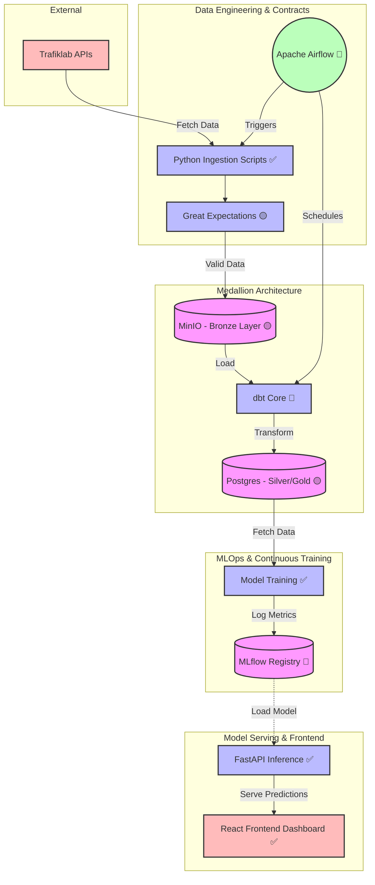

A data engineering and MLOps case study predicting real-time public transit delays across the Stockholm Metro network using GTFS data.

## 1. Problem & Requirements

**The Problem:**
Predict whether a metro train will experience a delay exceeding 60 seconds at upcoming stations, using historical and real-time SL (Storstockholms Lokaltrafik) traffic data. 

**The Complexity:**
Public transit data is notoriously difficult to model. It involves joining massive, slow-moving relational snapshots (800MB GTFS Static timetables) with high-velocity streaming feeds (GTFS Realtime Protobufs).

**Engineering Requirements:**
| Requirement | Target |
| :--- | :--- |
| **Prediction Latency** | < 100 ms (FastAPI inference) |
| **Data Freshness** | < 30 seconds (Live GTFS RT polling) |
| **Data Integrity** | Strict schema validation; halt on mutation |
| **Reproducibility** | Immutable raw data storage |
| **Target Distribution** | Highly right-skewed, strict positive timeline |

---

## 2. Implementation Status

This repository is an ongoing portfolio project. To provide an honest assessment of the system's current maturity, the architecture components are explicitly graded:

*   ✅ **Implemented**: Ingestion (Python), API Serving (FastAPI), Frontend Dashboard (React - *Hosted separately*), Dockerization, Baseline Heuristic Model, CI/CD Pipelines (GitHub Actions -> GHCR -> T480).
*   🟡 **Partially Implemented**: Advanced ML Models (STGCN, State Space drafted but not wired to inference), Medallion Storage (MinIO/Postgres scaffolded but lacking dbt transforms).
*   🔵 **Planned**: Airflow Orchestration DAGs, Feast Feature Store, MLflow Model Registry.

---

## 3. Architecture & Justification

The planned target architecture for this system utilizes a Medallion pattern (Bronze, Silver, Gold).



### Key Engineering Decisions

**Why Medallion Architecture (MinIO + Postgres)?**
I initially considered storing everything in a single PostgreSQL database to reduce operational complexity. However, transformations on raw GTFS data often destroy the original records. By introducing MinIO as an immutable Bronze layer, I preserve the raw API responses. This makes replaying ingestion and debugging transformation errors substantially easier.

**Why Airflow (Planned)?**
Airflow introduces substantial operational overhead for a solo project. However, it provides explicit DAG dependencies (e.g., waiting for dbt transformations to finish before triggering PyTorch training), task-level observability, and robust backfilling capabilities—a much closer approximation to production pipelines than simple `cron` jobs.

**Why Data Contracts (Great Expectations)?**
Adding validation layers increases ingestion latency. However, silent upstream schema mutations from third-party APIs are the leading cause of downstream ML degradation. Failing fast at the Bronze layer is infinitely preferable to serving corrupted predictions in production.

---

## 4. ML Approach & Modeling

Predicting transit delays is not a standard regression problem. Delays are spatially correlated (a stuck train delays the trains behind it) and non-normally distributed (heavily right-skewed with strict positive bounds).

### Features
*   `route_id` / `stop_id`
*   Time of day / Day of week
*   Historical average delay per platform
*   *(Planned)* Exogenous covariates (SMHI Weather)

### Models Evaluated

1.  **Baseline Heuristic (✅ Implemented)**: Maps the historical average delay for every `route_id` and `stop_id`. Serves as the MVP to validate the end-to-end API plumbing (ingestion -> serialization -> FastAPI serving).
2.  **Spatio-Temporal Graph Convolutional Network (STGCN) (🟡 Drafted)**: 
    *   *Why?* Standard regression treats stations as independent. STGCN explicitly models the physical topology of the Stockholm Metro tracks (spatial graph) and the propagation of delays over time (temporal sequence).
3.  **Cox Proportional Hazards (🟡 Drafted)**:
    *   *Why?* Transit delays suffer from "right-censoring"—in real-time, we observe trains that are currently delayed but *have not arrived yet*. Standard OLS regression must drop these rows. Survival analysis natively models this "time-to-event" mathematically.

For a rigorous proof of these algorithms, see the [`MATHEMATICAL_REASONING.md`](MATHEMATICAL_REASONING.md) document.

---

## 5. Deployment Strategy & Iterations

### The "OOM" Failure & Hybrid Edge-Cloud
Initially, I planned to deploy the entire stack to a 1GB RAM Oracle Cloud (OCI) instance. Upon reviewing the `inxi` metrics, I realized that running Airflow, Postgres, and MinIO while processing 800MB GTFS files would cause immediate Out-Of-Memory (OOM) kernel panics.

**The Fix:** I pivoted to a hybrid edge-cloud architecture. 
*   The heavy data-crunching (FastAPI, Docker, Data pipeline) runs on a local on-premise edge node (T480).
*   The lightweight React dashboard (`michiod.site`) is hosted on the 1GB OCI cloud server.
*   The two communicate securely via encrypted **Cloudflare Zero Trust Tunnels**, bypassing NAT port-forwarding issues and providing automatic HTTPS to satisfy browser Mixed Content policies.
*   Deployment is automated via **GitHub Actions**, which builds the Docker image, pushes it to GitHub Container Registry (`ghcr.io`), and triggers the T480 (via an OCI proxy jump host) to pull the immutable image.

---

## 6. Getting Started

1. Install dependencies via Poetry (or use standard virtual environment):
   ```bash
   poetry install
   # or
   python -m venv venv && source venv/bin/activate && pip install -r requirements.txt
   ```
2. Configure your API keys. Create a `.env` file in the root directory:
   ```env
   TRAFIKLAB_API_KEY="your_api_key_here"
   ```
3. Run the ingestion scripts to download the GTFS static timetables and real-time data to `data/bronze/`:
   ```bash
   python src/ingestion/gtfs_static_ingest.py
   python src/ingestion/gtfs_realtime_ingest.py
   ```
4. Run the baseline training pipeline (Joins GTFS RT to GTFS Static to generate the model):
   ```bash
   python src/ml_pipeline/train_baseline.py
   ```
5. Start the FastAPI inference server (or use Docker):
   ```bash
   uvicorn src.api.main:app --host 0.0.0.0 --port 8000
   ```
